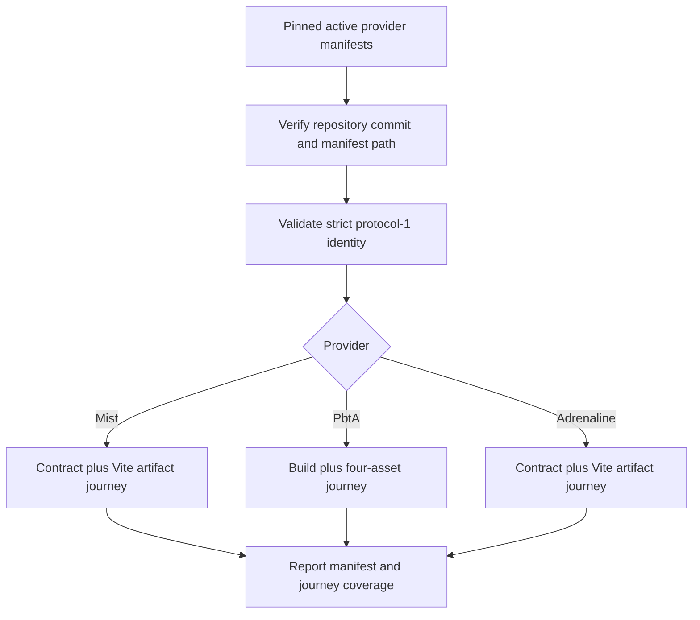
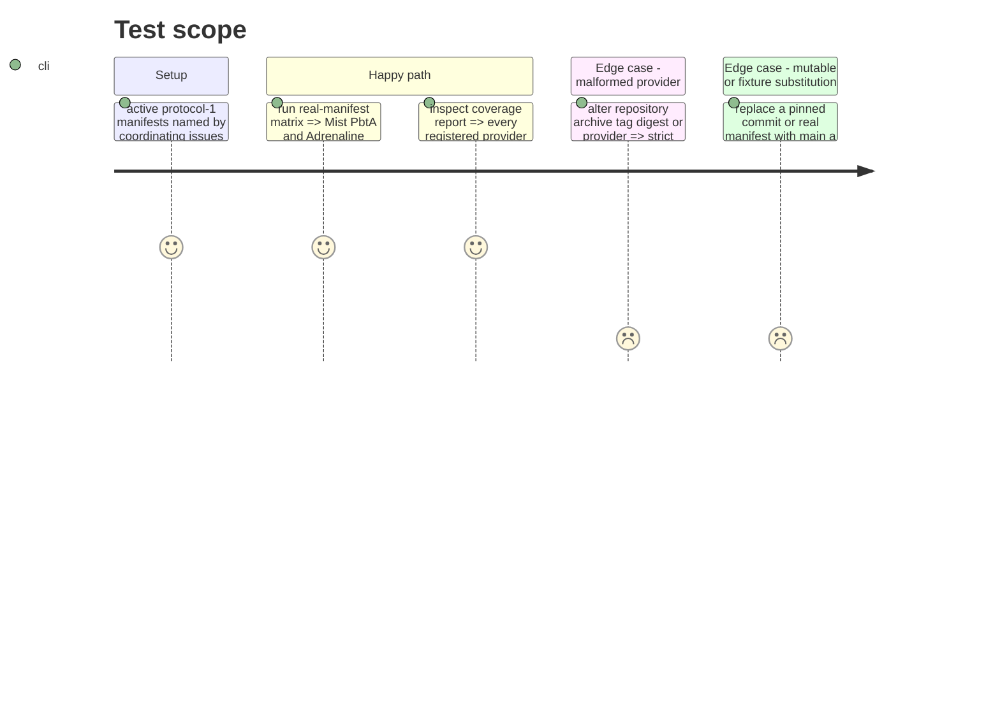

# Instruction: Three-provider protocol and real-manifest matrix

## Architecture projection

> Tree of the final files. ✅ create · ✏️ modify · ❌ delete

```txt
.
├── release-train.matrix.json ✅ pin every active canonical protocol-1 manifest path and provider commit with all three providers represented
└── tools
    ├── release-train-assert.mjs ✏️ add the Mist contract/build journey and shared Vite artifact proof
    ├── release-train-matrix.mjs ✅ validate pinned real manifests and dispatch every provider journey
    ├── release-train-protocol.mjs ✏️ strictly admit schema-in-the-mist alongside PbtA and Adrenaline
    └── release-train-protocol.harness.mjs ✏️ exercise manifest validation dispatch and evidence for all three providers
```

## User Journey



## Test Scope



## Tasks to do

### `1)` Complete strict protocol support

> Admit Mist without weakening the shared protocol or restoring a legacy envelope.

1. Wait for PbtA, Mist, and Adrenaline to expose current canonical protocol-1 manifests; keep superseded legacy manifests as historical evidence only.
2. Extend strict provider facts to `schema-in-the-mist` while retaining exact repository, archive basename, SemVer, tag, SHA-256, SRI, and full-commit validation.
3. Define Mist's journey as contract conformance plus the same production entry/chunk artifact proof used by the shared Vite path.
4. Extend the harness across valid and invalid manifests, provider dispatch, closed evidence, and canonical check identifiers for all three providers.

### `2)` Build the immutable real-manifest matrix

> Exercise current consumer journeys from real provider inputs without replaying stale candidate resolution against the final graph.

1. Add a registry entry for every active canonical protocol-1 manifest named by the coordinating provider issues, using its canonical repository, immutable provider commit, and manifest path; require at least one entry for each provider and allow multiple distinct manifests for one provider.
2. Verify each pinned checkout and path, reject fixture-only or mutable substitution, parse the protocol envelope, and dispatch only the selected provider's current Vite artifact journey.
3. Keep candidate archive/lock/ref equality in `release-train:assert` at each manifest's recorded immutable consumer ref; do not apply those historical resolution checks to another graph.
4. Report provider, manifest, and journey-check coverage and fail if Mist, PbtA, or Adrenaline is missing, or if any repository/commit/path tuple is duplicated.

## Test acceptance criteria

| Task | Acceptance criteria |
| --- | --- |
| 1 | Mist, PbtA, and Adrenaline use one strict protocol-1 parser and distinct current artifact journeys without a legacy-manifest adapter. |
| 1 | Unknown providers and any inconsistent repository, archive, tag, digest, commit, or consumer identity fail strict validation. |
| 2 | The matrix runs a provider-specific current Vite artifact journey for each active real manifest pinned by immutable provider commit and path. |
| 2 | The matrix rejects mutable refs, fixtures, duplicate manifest entries, missing providers, and stale candidate-resolution replay against a different consumer graph. |
