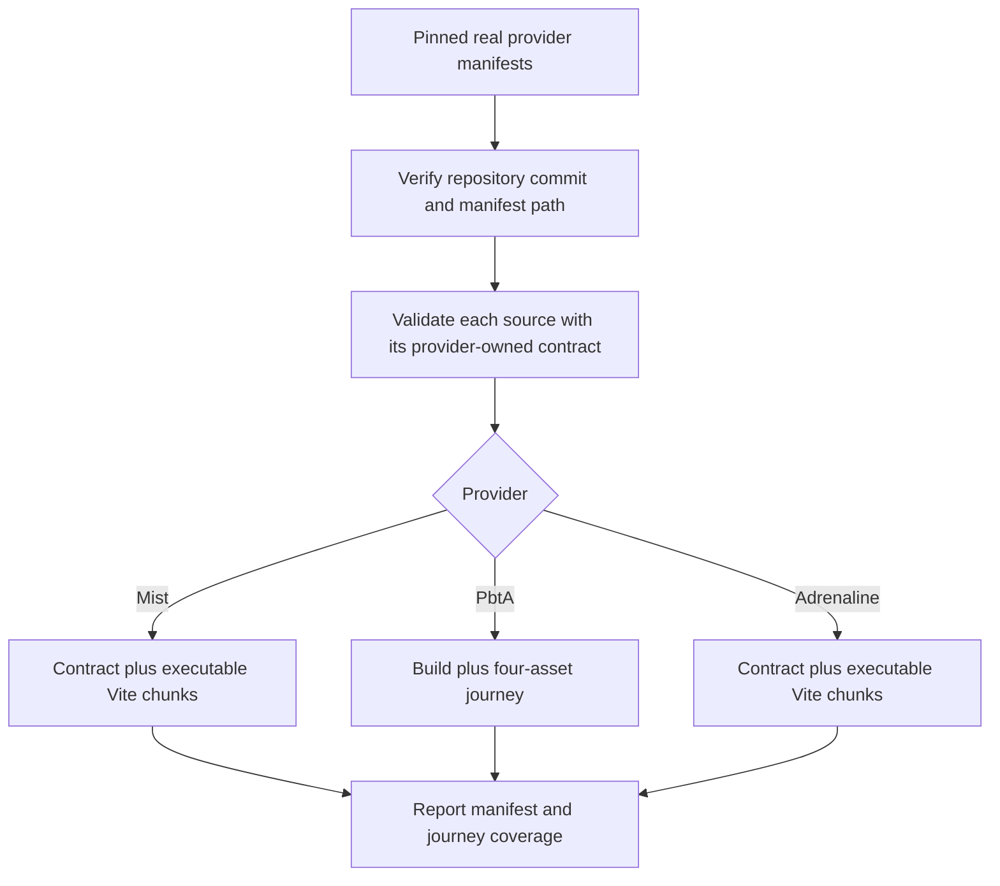
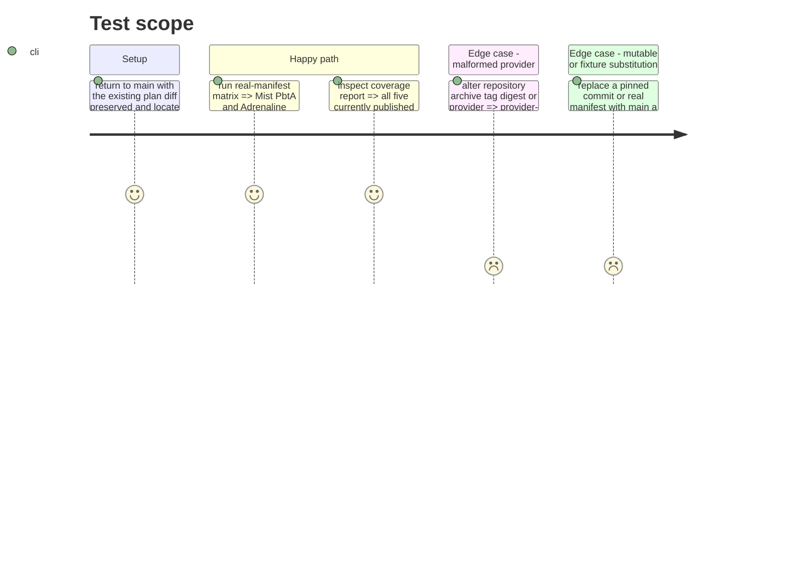

# Instruction: Three-provider real-manifest matrix

## Architecture projection

> Tree of the final files. ✅ create · ✏️ modify · ❌ delete

```txt
.
├── release-train.matrix.json ✅ pin every real provider-owned manifest path and immutable commit plus one Handbook commit
└── tools
    ├── release-train-matrix.mjs ✅ validate pinned real manifests and dispatch every provider journey
    └── release-train-matrix.harness.mjs ✅ cover manifest discovery, provider dialects, and shared journey dispatch
```

## User Journey


```mermaid
flowchart TD
  A[Pinned real provider manifests] --> B[Verify repository commit and manifest path]
  B --> C[Validate each source with its provider-owned contract]
  C --> D{Provider}
  D -->|Mist| E[Contract plus executable Vite chunks]
  D -->|PbtA| F[Build plus four-asset journey]
  D -->|Adrenaline| G[Contract plus executable Vite chunks]
  E --> H[Report manifest and journey coverage]
  F --> H
  G --> H
```

## Test Scope


```mermaid
---
title: Test scope
---
journey
  section Setup
    return to main with the existing plan diff preserved and locate all published PbtA Adrenaline and Mist manifests => unique immutable repository commit and path entries cover all three providers: 5: cli
  section Happy path
    run real-manifest matrix => Mist PbtA and Adrenaline validate identity and dispatch their current Vite artifact journeys: 5: cli
    inspect coverage report => all five currently published manifests and three provider journeys are accounted for: 5: cli
  section Edge case - malformed provider
    alter repository archive tag digest or provider => provider-owned validation rejects the train: 1: cli
  section Edge case - mutable or fixture substitution
    replace a pinned commit or real manifest with main a fixture or a duplicate entry => matrix rejects the input before journey dispatch: 1: cli
```

## Tasks to do

### `1)` Verify the three published manifest dialects

> Validate each provider's published input without creating a Lantern-owned substitute.

1. Resume implementation on `main` under the repository rule, preserving the tracked plan diff currently on `fix/pbta-candidate-proof`.
2. Inventory the published provider trees, then pin immutable commits and paths for PbtA `release-train/schema-pbta-v8.4.2.json` and `schema-pbta-v8.4.3.json`, Adrenaline `release-train/schema-adrenaline-v2.4.0.json` and `schema-adrenaline-v2.5.0.json`, and Mist `release-trains/v1.3.5.json`. Record their current or historical role; compare registry coverage to the pinned provider trees, not mutable remote branches.
3. Validate each raw manifest using the provider's published dialect and validator at its pinned commit. The older Adrenaline commit exposes `npm run release-train:assert -- <manifest>` for its `manifestVersion: 1` envelope; PbtA exposes `validate:release-train`, and Mist exposes `release-train:validate`. Keep Lantern's strict protocol-1 candidate and protocol-2 final parsers for consumer proofs; never pass orchestration-only `path` and `proof` fields to them.
4. Retain the published protocol-1 check identifiers. Verify production entry and chunks for all three provider journeys and the four served Monsterhearts assets for PbtA. Current Lantern templates import no Mist- or Adrenaline-specific binary assets, so do not report such assets as proved.
5. Cover each real input dialect, malformed provider metadata, journey dispatch, and closed consumer evidence in the harness. When Mist #25 publishes its post-promotion format, pin that new provider commit and prove the transition.

### `2)` Build the immutable real-manifest matrix

> Exercise current consumer journeys from real provider inputs without replaying stale candidate resolution against the final graph.

1. Add one registry entry per real provider-owned manifest naming Lantern, using its canonical repository, immutable provider commit, and actual path. Keep the single immutable Handbook commit used for cross-consumer pin checks in this same registry.
2. Verify each pinned checkout and path, reject fixture-only or mutable substitution, validate each manifest under its published dialect, and dispatch the provider's current Vite artifact journey. Run the production build, contract assertion, entry/chunk proof, and four-asset Monsterhearts proof once each for the current Lantern graph; map only the checks actually performed to each provider journey and report each manifest separately.
3. Keep candidate archive/lock/ref equality in `release-train:assert` at each manifest's recorded immutable consumer ref; do not apply those historical resolution checks to another graph.
4. Report provider, manifest, and journey-check coverage and fail if Mist, PbtA, or Adrenaline is missing, or if any repository/commit/path tuple is duplicated.

## Test acceptance criteria

| Task | Acceptance criteria |
| --- | --- |
| 1 | Mist, PbtA, and Adrenaline real manifests each validate under their provider-owned contract and dispatch distinct current artifact journeys; reports distinguish executable chunks from the four PbtA assets, and Lantern's consumer evidence parser stays strict. |
| 1 | Unknown providers and any inconsistent repository, archive, tag, digest, commit, or consumer identity fail validation. |
| 2 | The matrix accounts for every real published manifest naming Lantern and pins each by immutable provider commit and path; the default check performs one production build, one contract assertion, and one served-asset check for the current graph. |
| 2 | The matrix rejects mutable refs, fixtures, duplicate manifest entries, missing providers, and stale candidate-resolution replay against a different consumer graph. |
