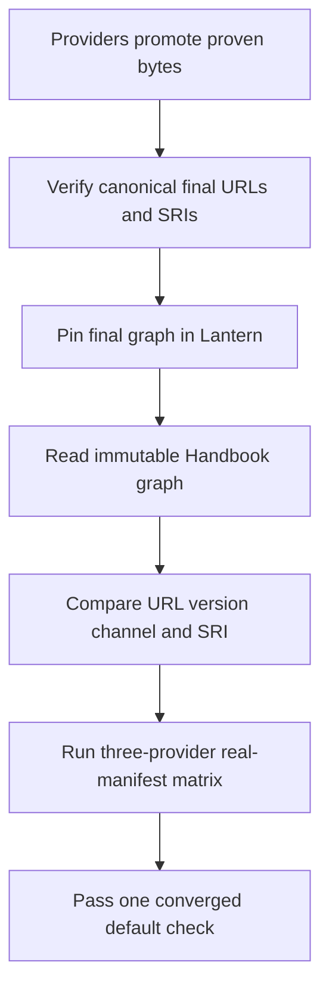
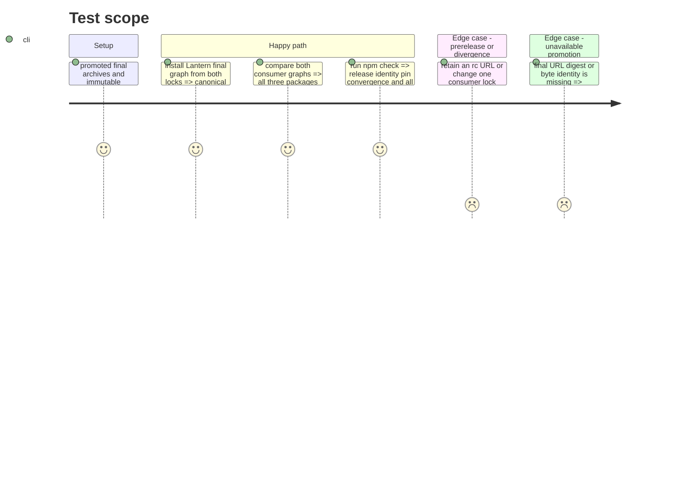

# Instruction: Final provider and consumer-pin convergence

## Architecture projection

> Tree of the final files. ✅ create · ✏️ modify · ❌ delete

```txt
.
├── .github/workflows
│   ├── check.yml ✏️ provide immutable provider and Handbook inputs required by default cross-repository checks
│   └── release.yml ✏️ provision the same pinned inputs before its release-blocking default check
├── CHANGELOG.md ✏️ freeze the v0.16.1 date and final provider versions
├── package.json ✏️ replace promoted candidates and add pin convergence plus the provider matrix to the default check
├── package-lock.json ✏️ record final Mist PbtA and Adrenaline URLs versions and published SRIs
├── pnpm-lock.yaml ✏️ record the identical final provider graph for frozen pnpm installs
└── tools
    └── assert-consumer-schema-pins.mjs ✏️ require exact final URL version and SRI agreement for Mist PbtA and Adrenaline
```

## User Journey



## Test Scope



## Tasks to do

### `1)` Converge on promoted final provider bytes

> Replace staged URLs only after each provider publishes the already-proven bytes canonically.

1. Confirm PbtA v8.4.3, Mist v1.3.5, and Adrenaline v2.5.0 final archives exist under canonical filenames and match their proven candidate bytes and published SRIs.
2. Replace all three Lantern dependency URLs and npm/pnpm lock resolutions with those final URLs and exact SRIs, preserving unrelated graph entries.
3. Coordinate the equivalent Handbook final pins under its own issue and freeze the v0.16.1 changelog date/provider identities only after both graphs are ready.
4. Reject every promoted provider's `-rc` URL and retain earlier candidate evidence unchanged.

### `2)` Enforce canonical consumer pins by default

> Turn the existing optional two-package comparison into the release-channel convergence gate.

1. Resolve Handbook package and pnpm-lock metadata from explicit overrides or the documented sibling checkout and fail clearly when required comparison input is missing.
2. For all three providers, require both consumers to declare the same canonical final archive URL and exact release version.
3. Verify matching URL, version, and SRI in Lantern's npm and pnpm locks and Handbook's pnpm lock.
4. Add this assertion and the three-provider real-manifest matrix to `npm run check`; make both check and release workflows provide the same immutable Handbook/provider checkouts instead of silently skipping them.

## Test acceptance criteria

| Task | Acceptance criteria |
| --- | --- |
| 1 | Lantern and Handbook use canonical final URLs and published SRIs for Mist 1.3.5, PbtA 8.4.3, and Adrenaline 2.5.0, with no promoted provider left on an rc URL. |
| 1 | Frozen npm and pnpm installs materialize the final graph without unrelated resolution drift. |
| 2 | `npm run check` fails when either consumer differs in URL, version, release channel, or lockfile SRI. |
| 2 | The converged graph passes release identity, exact cross-consumer pins, and current Mist/PbtA/Adrenaline artifact journeys in the default check. |
| 2 | Check and release workflows provision identical pinned cross-repository inputs, so the release-blocking default check does not depend on an undeclared sibling checkout. |
