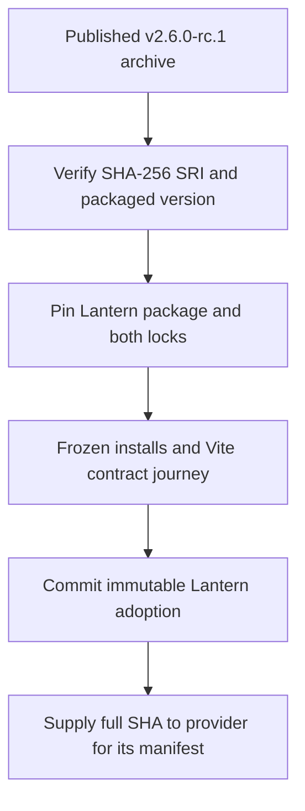
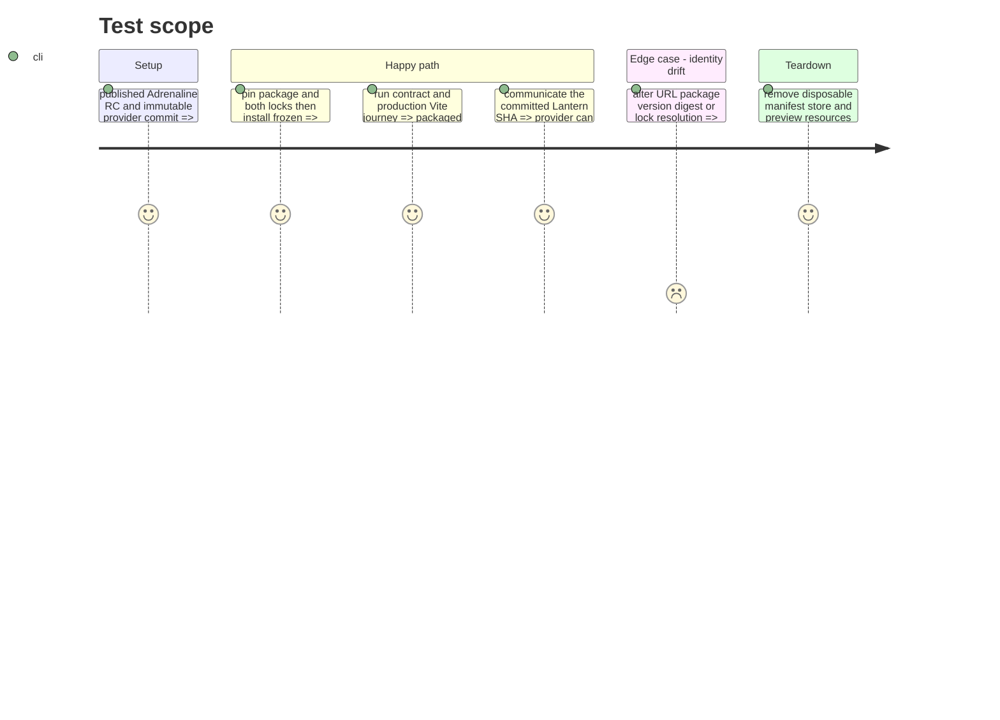

# Instruction: Adrenaline 2.6.0 candidate adoption checkpoint

## Architecture projection

> Tree of the final files. ✅ create · ✏️ modify · ❌ delete

```txt
.
├── package.json ✏️ pin the v2.6.0-rc.1 archive without changing other provider versions
├── package-lock.json ✏️ record the candidate URL, package version, and published SRI
├── pnpm-lock.yaml ✏️ record the same direct candidate while preserving the unrelated graph
└── aidd_docs/tasks/2026_09/2026_09_25_issues_46_47_release_identity_and_pbta_proof/phase-5.md ✏️ mark the verified candidate checkpoint done
```

## User Journey


```mermaid
flowchart TD
  A[Published v2.6.0-rc.1 archive] --> B[Verify SHA-256 SRI and packaged version]
  B --> C[Pin Lantern package and both locks]
  C --> D[Frozen installs and Vite contract journey]
  D --> E[Commit immutable Lantern adoption]
  E --> F[Supply full SHA to provider for its manifest]
```

## Test Scope


```mermaid
---
title: Test scope
---
journey
  section Setup
    published Adrenaline RC and immutable provider commit => candidate identity is known: 5: cli
  section Happy path
    pin package and both locks then install frozen => installed Adrenaline is 2.6.0 with published SRI: 5: cli
    run contract and production Vite journey => packaged presentation imports execute: 5: cli
    communicate the committed Lantern SHA => provider can name the exact consumer checkpoint: 5: cli
  section Edge case - identity drift
    alter URL package version digest or lock resolution => candidate proof fails before evidence: 1: cli
  section Teardown
    remove disposable manifest store and preview resources => adoption worktree remains clean: 5: cli
```

## Tasks to do

### `1)` Adopt the exact published candidate

> Keep the candidate checkpoint distinct from the later final release pin.

1. Verify `v2.6.0-rc.1/schema-adrenaline-2.6.0.tgz` against its published SHA-256, SHA-512 SRI, packed `package.json` version, and provider tag commit. Do not substitute the v2.5.0 archive.
2. Change only the direct Adrenaline pin in `package.json`, npm lock, and pnpm lock; use the controlled lock generator and reject transitive dependency drift. Preserve the staged PbtA evidence and final PbtA/Mist pins.
3. Prove frozen npm and pnpm installs, contracts, executable Vite chunks, and the published Adrenaline presentation import. Commit the adoption on `main` and communicate its full SHA to the provider. Do not run the final-only cross-consumer pin gate as a candidate criterion.

## Test acceptance criteria

| Task | Acceptance criteria |
| --- | --- |
| 1 | Both Lantern locks and the installed package resolve the v2.6.0-rc.1 URL, package version 2.6.0, and published SRI; unrelated graph entries do not drift. |
| 1 | Frozen installs, contracts, Vite build, executable chunks, and the presentation import pass at the committed Lantern candidate SHA. |
| 1 | No final v2.6.0 pin, release tag, or v0.16.1 publication is claimed from candidate adoption alone. |
