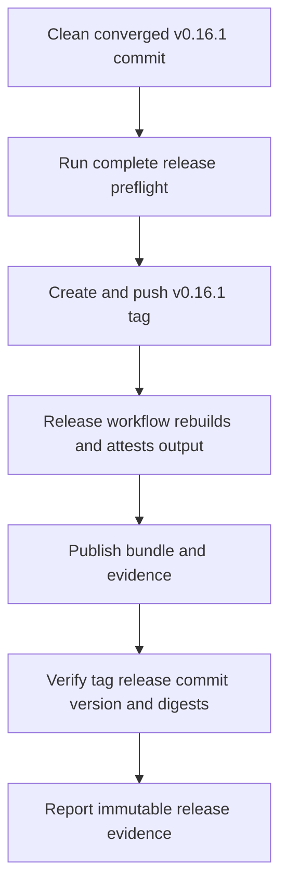
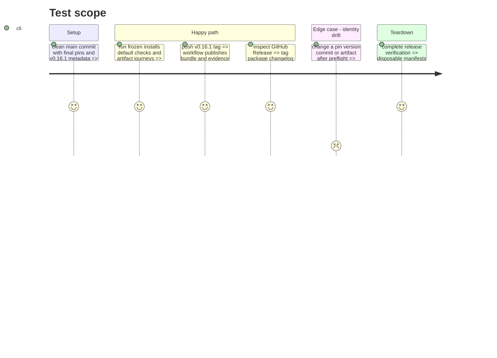

# Instruction: Immutable v0.16.1 publication

## Architecture projection

> Tree of the final files. ✅ create · ✏️ modify · ❌ delete

```txt
(no additional tracked product files)
├── v0.16.1 🏷️ version tag on the clean converged main commit
└── GitHub Release v0.16.1 📦 production bundle and machine-readable evidence created by release workflow
```

## User Journey



## Test Scope



## Tasks to do

### `1)` Prove the release commit

> Freeze the exact main commit only after every provider and consumer gate passes.

1. Run frozen npm/pnpm installs, the complete default check, and all provider-specific artifact journeys on the clean v0.16.1 release state.
2. Run a local release-build dry run to verify the evidence generator can content-address the application entry, executable chunks, both fonts, and both marks for the complete prospective release commit.
3. Commit any documentary completion updates, rerun the preflight on the final clean main commit, and retain that full SHA as the only tag target; only the later workflow build and its digests are authoritative publication evidence.

### `2)` Publish and verify v0.16.1

> Let the enforced workflow create the GitHub Release, then verify its external identity.

1. Create and push the `v0.16.1` tag on the proven main commit using the repository's established tag convention.
2. Require the release workflow to publish its freshly built production bundle and evidence, then verify Release name/tag/target, package and UI version, changelog, bundle digest, evidence commit, and absence of prerelease URLs.
3. Report the final Lantern SHA and release evidence to the coordinating provider and Handbook issues.
4. Leave deployment or restart of operator-managed Lantern instances outside repository automation.

## Test acceptance criteria

| Task | Acceptance criteria |
| --- | --- |
| 1 | The clean final commit passes frozen installs, the default Mist/PbtA/Adrenaline matrix, cross-consumer pin checks, and application artifact checks without changing tracked files. |
| 1 | Lantern's release evidence identifies the executable chunks and four served Monsterhearts assets by path, size, and digest. |
| 2 | `v0.16.1`, package/lock version, changelog entry, user-visible build version, GitHub Release, target commit, and attached artifact evidence agree exactly. |
| 2 | The published GitHub Release is the repository's release evidence; no unsupported deployment record is claimed or required. |
