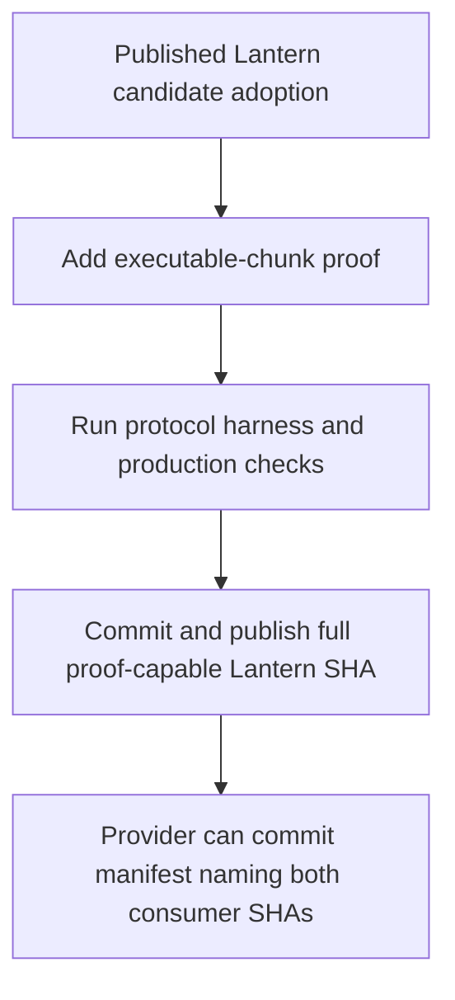
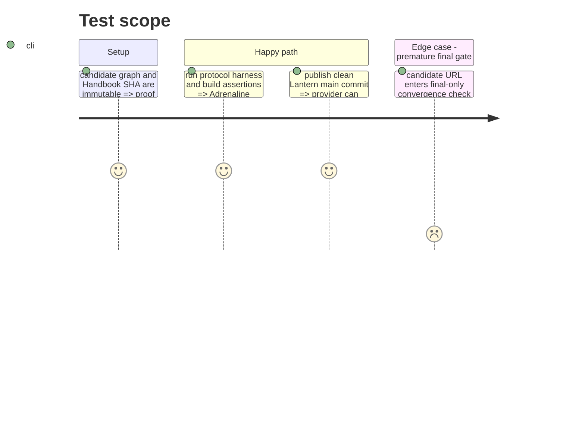

# Instruction: Immutable Lantern proof-capable candidate checkpoint

## Architecture projection

> Tree of the final files. ✅ create · ✏️ modify · ❌ delete

```txt
.
├── release-train.matrix.json ✏️ pin Handbook's published v2.6.0 candidate adoption SHA
├── tools
│   ├── release-train-assert.mjs ✏️ run the served executable-chunk assertion after the Adrenaline Vite build
│   └── release-train-protocol.harness.mjs ✏️ assert the exact Adrenaline journey checks
└── aidd_docs/tasks/2026_09/2026_09_25_issues_46_47_release_identity_and_pbta_proof/phase-6.md ✏️ mark the proof-capable checkpoint done
```

## User Journey


```mermaid
flowchart TD
  A[Published Lantern candidate adoption] --> B[Add executable-chunk proof]
  B --> C[Run protocol harness and production checks]
  C --> D[Commit and publish full proof-capable Lantern SHA]
  D --> E[Provider can commit manifest naming both consumer SHAs]
```

## Test Scope


```mermaid
---
title: Test scope
---
journey
  section Setup
    candidate graph and Handbook SHA are immutable => proof code has stable inputs: 5: cli
  section Happy path
    run protocol harness and build assertions => Adrenaline journey includes contracts Vite and served chunks: 5: cli
    publish clean Lantern main commit => provider can name one full proof-capable consumer SHA: 5: cli
  section Edge case - premature final gate
    candidate URL enters final-only convergence check => candidate checkpoint refuses that check without replacing the RC: 1: cli
```

## Tasks to do

### `1)` Publish the consumer proof implementation before its manifest

> Break the provider-manifest dependency cycle without changing provider-owned data.

1. Pin Handbook `de75bbcd8772415b69bf26394ba087b7874d8e9d` in the shared registry as the published candidate consumer ref.
2. Add the served executable-chunk check to the Adrenaline protocol-1 journey and its harness, after the existing contract and Vite checks. Leave the final-only cross-consumer gate out of this candidate checkpoint.
3. Run protocol tests, the production build, contracts, and served-chunk checks against the candidate graph; commit and publish the full Lantern SHA on `main` for the provider manifest.

## Test acceptance criteria

| Task | Acceptance criteria |
| --- | --- |
| 1 | The published Lantern commit retains the exact v2.6.0-rc.1 URL, version and SRI and pins Handbook's full candidate SHA. |
| 1 | At that same Lantern commit, the Adrenaline journey includes contracts, Vite build and served executable chunks; protocol tests and default candidate checks pass. |
| 1 | The commit has no final Adrenaline URL or final-only gate, and the provider can reference it immutably before writing its manifest. |
