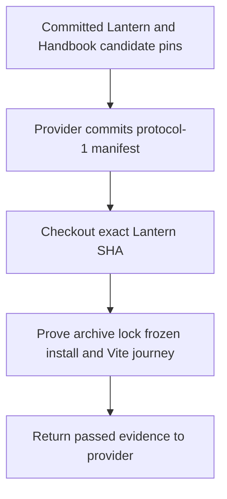
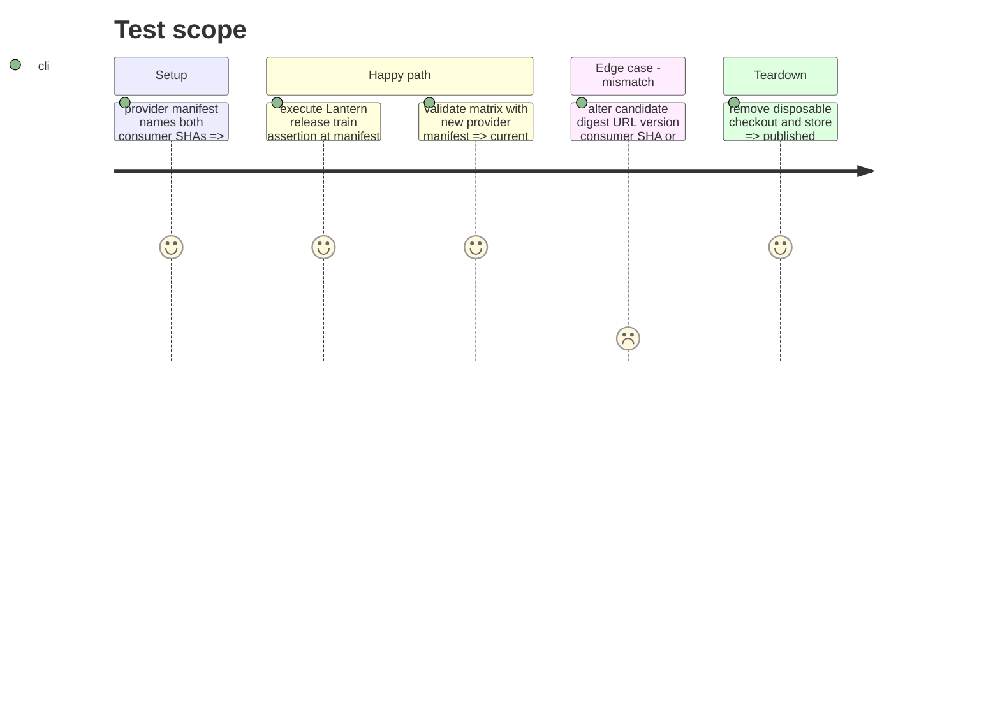

# Instruction: Provider-owned Adrenaline 2.6.0 candidate proof

## Architecture projection

> Tree of the final files. ✅ create · ✏️ modify · ❌ delete

```txt
.
├── release-train.matrix.json ✏️ add the committed v2.6.0 manifest once the provider publishes it
└── aidd_docs/tasks/2026_09/2026_09_25_issues_46_47_release_identity_and_pbta_proof/phase-7.md ✏️ record verified manifest and evidence refs
```

## User Journey



## Test Scope



## Tasks to do

### `1)` Consume the provider manifest

> Never manufacture a provider manifest or consumer identity locally.

1. Verify Handbook's published candidate correction at `de75bbcd8772415b69bf26394ba087b7874d8e9d`; do not modify its graph from Lantern.
2. Read the provider-committed v2.6.0 protocol-1 manifest naming the exact phase-6 Lantern proof-capable SHA and Handbook SHA. Reject a mutable ref or changed archive identity.
3. Run `release-train:assert` in a disposable checkout of the pinned Lantern commit and require passed SHA-256, SRI, installed version, lock, contract, Vite and executable-chunk checks before evidence is emitted.
4. Add the published manifest to the immutable matrix registry with its provider validator ref; verify the matrix still covers the historical manifests and all three current journeys.
5. Return the evidence path and full Lantern SHA to the provider. Wait for byte-identical final promotion before phase 7.

## Test acceptance criteria

| Task | Acceptance criteria |
| --- | --- |
| 1 | The provider-owned protocol-1 manifest names exact full Lantern and Handbook commits and the published v2.6.0-rc.1 archive identity. |
| 1 | Lantern's consumer proof validates archive SHA-256/SRI, package version 2.6.0, both locks, frozen install, contracts and Vite journey before writing passed evidence. |
| 1 | The matrix covers the new committed provider manifest without rewriting historical evidence or treating a local fixture as authoritative. |
