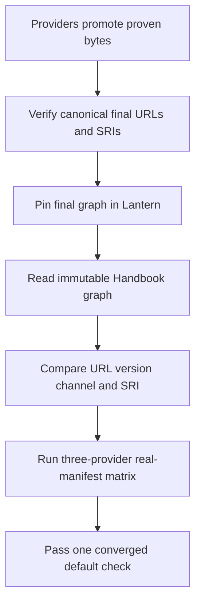
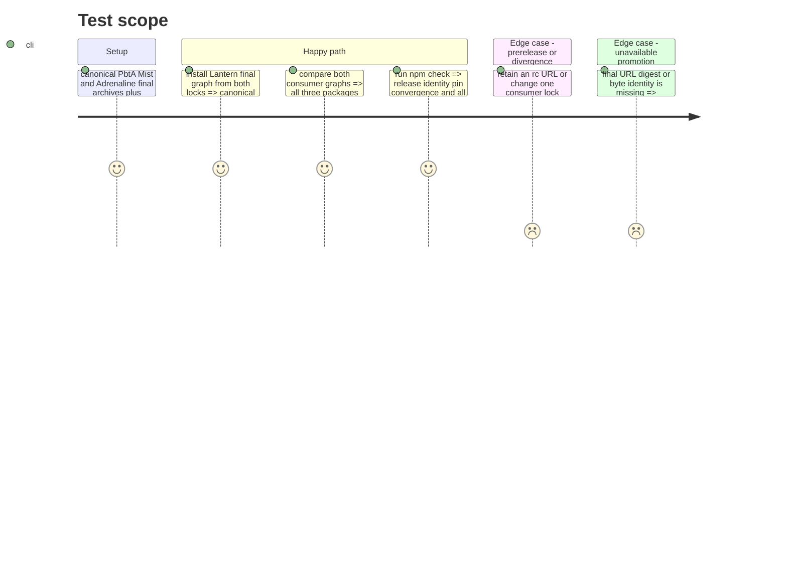

# Instruction: Final provider and consumer-pin convergence after Adrenaline 2.6.0 promotion

## Architecture projection

> Tree of the final files. ✅ create · ✏️ modify · ❌ delete

```txt
.
├── CHANGELOG.md ✏️ freeze the v0.16.1 date and final provider versions
├── package.json ✏️ replace promoted candidates and add pin convergence plus the provider matrix to the default check
├── package-lock.json ✏️ record final Mist PbtA and Adrenaline URLs versions and published SRIs
├── pnpm-lock.yaml ✏️ record the identical final provider graph for frozen pnpm installs
├── release-train.matrix.json ✏️ supply the single immutable Handbook ref used by local and CI pin checks
└── tools
    ├── assert-consumer-schema-pins.mjs ✏️ require exact final URL version and SRI agreement for Mist PbtA and Adrenaline
    └── resolve-release-inputs.mjs ✅ materialize or verify registry-pinned provider and Handbook inputs for the shared default check
```

## User Journey



## Test Scope



## Tasks to do

### `1)` Converge on promoted final provider bytes

> Replace staged URLs only after each provider publishes the already-proven bytes canonically.

1. Verify the published PbtA v8.4.3 and Mist v1.3.5 final archives against provider SHA-256 and SRI. Require Adrenaline to promote the proven v2.6.0-rc.1 bytes unchanged at `v2.6.0/schema-adrenaline-2.6.0.tgz`; the v2.5.0 final-tag `candidate.tgz` and the v2.6.0 RC URL do not satisfy this gate.
2. Replace Lantern's remaining PbtA and Adrenaline candidate URLs in `package.json`, npm lock, and pnpm lock with canonical final URLs and exact SRIs; retain Mist's existing final v1.3.5 pin and preserve unrelated graph entries.
3. Coordinate the equivalent Handbook final pins under its own issue and freeze the v0.16.1 changelog date/provider identities only after both graphs are ready.
4. Reject every promoted provider's `-rc` URL and retain earlier candidate evidence unchanged.

### `2)` Enforce canonical consumer pins by default

> Turn the existing optional two-package comparison into the release-channel convergence gate.

1. Resolve Handbook package and pnpm-lock metadata at the sole full commit SHA in `release-train.matrix.json`; reuse a local checkout only after verifying that SHA, otherwise fetch the exact public commit to a disposable location. Reject missing or mutable refs.
2. For all three providers, require both consumers to declare the same canonical final archive URL and exact release version.
3. Verify matching URL, version, and SRI in Lantern's npm and pnpm locks and Handbook's pnpm lock.
4. Add this assertion and the three-provider real-manifest matrix to `npm run check` through one input-resolution entrypoint. Check and release workflows invoke that same gate and registry; remove duplicate build, contract, and served-asset invocations from the default check while retaining their standalone commands.

## Test acceptance criteria

| Task | Acceptance criteria |
| --- | --- |
| 1 | Lantern and Handbook use canonical final URLs and published SRIs for Mist 1.3.5, PbtA 8.4.3, and Adrenaline 2.6.0; `v2.5.0/candidate.tgz` and all rc URLs are rejected. |
| 1 | Frozen npm and pnpm installs materialize the final graph without unrelated resolution drift. |
| 2 | `npm run check` fails when either consumer differs in URL, version, release channel, or lockfile SRI. |
| 2 | The converged graph passes release identity, exact cross-consumer pins, and current Mist/PbtA/Adrenaline artifact journeys in the default check. |
| 2 | Local checks and both workflows resolve identical pinned cross-repository inputs from one registry, without depending on an undeclared sibling checkout or repeating current-graph build and contract work for historical manifests. |
